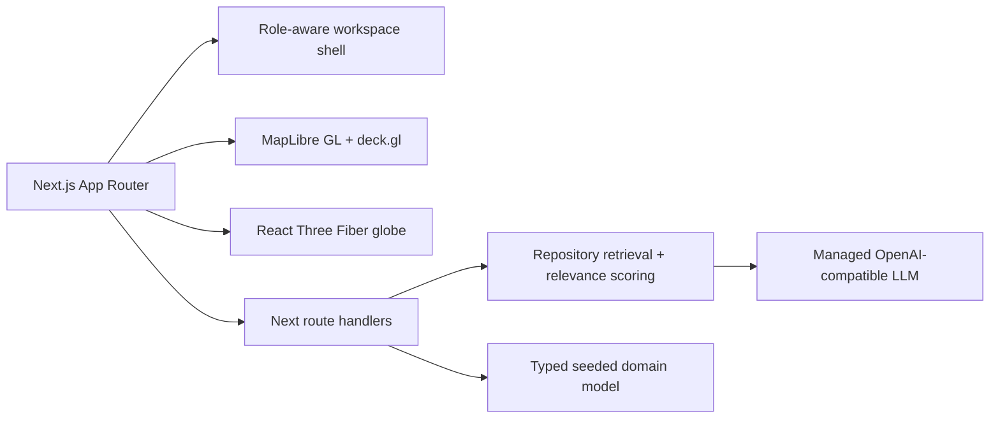

# BhuNiti

BhuNiti is a full-stack Next.js 15 demo for Smart India Hackathon 2026 Problem Statement 26019: a national platform for evidence-based land governance.

## Run locally

```bash
pnpm install
pnpm seed
pnpm dev
```

Open `http://localhost:3000`. The managed Preview injects `MANUS_API_URL` and `MANUS_API_KEY` when the platform LLM is available. Without those values, AI routes use a deterministic citation-grounded fallback.

## Architecture



## Demo roles

Choose any role from `/login`: Government Official, Researcher, Student, Institution Admin, Public User or Super Admin. The role selector changes the workspace context and the UI keeps the permissions/DPDP model visible.

## Routes

Public: `/`, `/solution`, `/innovation`, `/developers`.
Workspace: `/dashboard`, `/repository`, `/search`, `/recommendations`, `/copilot`, `/gis`, `/analytics`, `/simulation`, `/projects`, `/early-warning`, `/knowledge-graph`, `/time-machine`, `/integrations`, `/permissions`, `/api-docs`, `/profile`.

## Real vs seeded

Real application logic includes App Router routing, typed relevance scoring, CSV/GeoJSON preview seam, Web Speech API voice-search path, real MapLibre GL map initialization, deck.gl overlays, React Three Fiber globe, scenario slider calculations, role-aware navigation, API route handling, report/export actions and the managed LLM call when runtime credentials/quota are available. Seeded data includes the repository records, district/state boundary sample features, policy scores, risk rankings, analytics series, project activity and adapter statuses. External national connectors, persistent production database writes and non-LLM source ingestion remain documented sample adapters for the demo.
